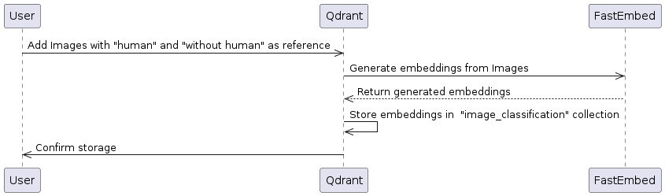
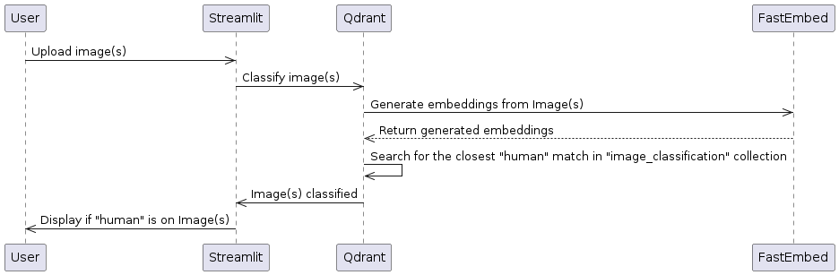

# qdrant-images-classification application architecture

## Adding reference images to Qdrant Collection


## Upload images and ask ask for "human" classification  



# Python 3.10.14 (Ubuntu)

```
curl https://pyenv.run | bash
pyenv install --list | grep 3.10.14
pyenv install 3.10.14
mkdir venv
pip install virtualenv
~/.local/bin/virtualenv --version
~/.local/bin/virtualenv  -p ~/.pyenv/versions/3.10.14/bin/python3.10 venv/
source venv/bin/activate
python3 --version   
```

# Install requirements
```
pip3 install -r requirements.txt
```

# Run application
```
streamlit run app.py
```